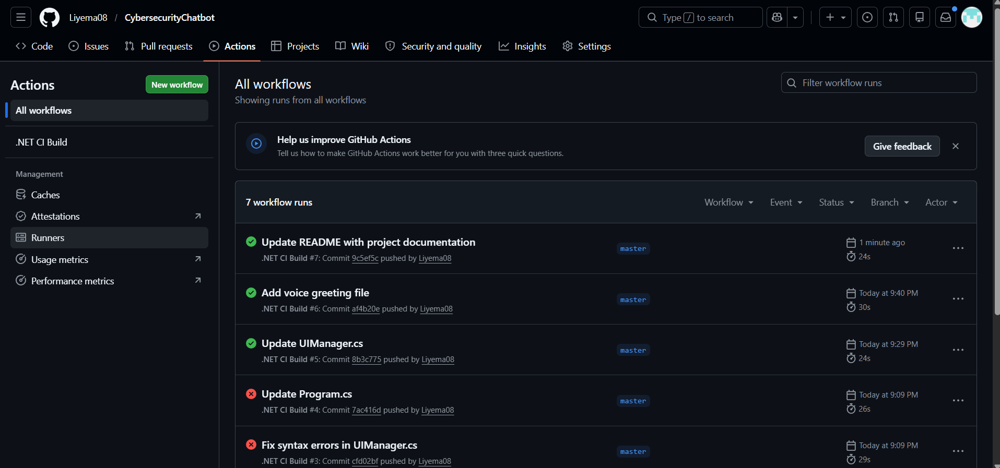

## YEMA-CYBER Security Bot

A cybersecurity awareness chatbot that educates users about online safety, password security, and phishing prevention.

## Features

- Voice Greeting - Plays a welcome message when the program starts
- ASCII Art Logo - Visual branding with custom ASCII art
- Personalized Interaction - Uses user's name throughout the conversation
- Cybersecurity Topics - Covers password safety, phishing, safe browsing, and 2FA
- Colorful Console UI - Enhanced interface with colored text and typing effects
- Input Validation - Handles empty inputs gracefully
- CI/CD Pipeline - GitHub Actions for automated builds

## CI/CD Status

The GitHub Actions workflow automatically builds and tests the project on every push. The green checkmark confirms all builds are successful.

## How to Run

1. Clone the repository
2. Open in Visual Studio 2022
3. Build the solution (Ctrl+Shift+B)
4. Run the program (F5)

## Example Questions

- "How are you?"
- "Tell me about passwords"
- "What is phishing?"
- "How to browse safely?"
- "What is 2FA?"
- "goodbye" (to exit)

## Project Structure

- Program.cs - Entry point
- Chatbot.cs - Conversation logic
- ResponseHandler.cs - Response generation
- UIManager.cs - Console UI management
- AudioManager.cs - Voice greeting playback
- AsciiArt.cs - ASCII art storage
- greeting.wav - Voice greeting file

## Author

Liyema

## GitHub Repository

https://github.com/Liyema08/CybersecurityChatbot

https://github.com/Liyema08/CybersecurityChatbot
